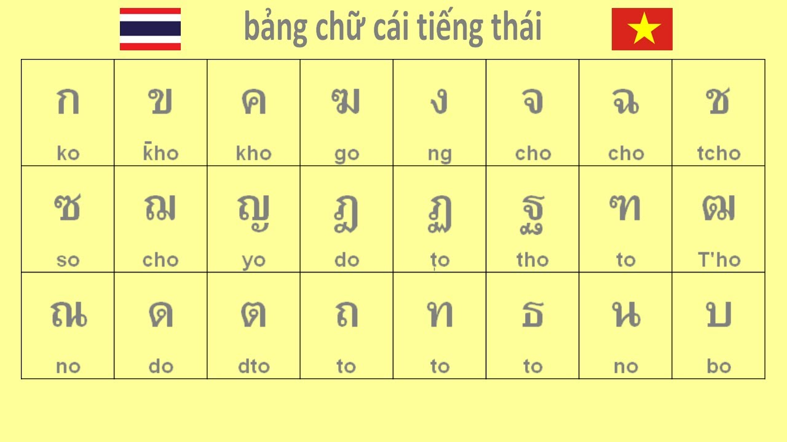

# Tự học Tiếng Thái

Đây là một hướng dẫn (lộ trình) tự học Tiếng Thái thông qua Comprehensible Input (Nội dung dễ hiểu) và Immersion, *hoàn toàn miễn phí*.

Bạn sẽ cần thời gian. *Rất nhiều thời gian*. Không thể học một ngôn ngữ chỉ trong một tháng, ai nói vậy thì chỉ nói vớ vẩn thôi. Điều quan trọng là phải học **liên tục mỗi ngày**, hoặc ít nhất là gần như vậy. Bạn cần xây dựng thói quen tiếp xúc thường xuyên với ngôn ngữ, đó là cách duy nhất để tiến bộ thật sự. Có nhiều ước tính ngoài kia về tổng số giờ cần để học một ngôn ngữ. Khi mình dành nhiều thời gian hơn mỗi ngày, mình tiến bộ nhanh hơn -- đơn giản vậy thôi.

Bạn nên (*cần*) đọc [Hướng dẫn tự học ngoại ngữ đầy đủ này](https://daihocmo.github.io/ngoai-ngu/orca/giai-doan-0/) để hiểu về phương pháp học ngoại ngữ được trình bày trong trang này.

## Nền tảng

### Bảng chữ cái

Bảng chữ cái tiếng Thái gồm 44 phụ âm và 32 nguyên âm. Học bảng chữ cái là nền tảng căn bản khi bạn tìm hiểu về bất kỳ ngôn ngữ nào, tiếng Thái cũng vậy. Bạn nên học từ cách phát âm cho đến cách viết bảng chữ cái tiếng Thái thật chuẩn xác.

Phát âm chuẩn xác sẽ giúp bạn biết cách đọc từ mới và nghe nói tiếng Thái dễ dàng sau này. Biết viết chữ cái tiếng Thái thành thạo giúp bạn dễ dàng nhận biết mặt chữ, nhận biết từ trong câu tiếng Thái để hiểu nghĩa.

Đây cũng là lý do vì sao nhiều bạn thấy tiếng Thái viết dính sát vào nhau mà vẫn có thể đọc và hiểu được. Tất cả đều có nguyên tắc cụ thể về cách đọc, viết bảng chữ cái tiếng Thái.

Học bảng chữ cái là nền tảng để học tiếng Thái hiệu quả

<iframe width="560" height="315" src="https://www.youtube.com/embed/uk5spKLFdL8?si=fTUVZ7UgflSwT4c1" title="YouTube video player" frameborder="0" allow="accelerometer; autoplay; clipboard-write; encrypted-media; gyroscope; picture-in-picture; web-share" referrerpolicy="strict-origin-when-cross-origin" allowfullscreen></iframe>

*Bạn có thể xem video hướng dẫn ở đây*

### Phát âm và ngữ điệu tiếng Thái

*video hướng dẫn:*

<iframe width="560" height="315" src="https://www.youtube.com/embed/YbqclZr8apU?si=0bg0r-pOT6LodKNY" title="YouTube video player" frameborder="0" allow="accelerometer; autoplay; clipboard-write; encrypted-media; gyroscope; picture-in-picture; web-share" referrerpolicy="strict-origin-when-cross-origin" allowfullscreen></iframe>

Tiếng Thái là một ngôn ngữ có thanh điệu, và các thanh điệu này được hình thành bởi hệ thống dấu thanh đặc trưng. Tương tự như tiếng Việt có 6 thanh điệu được biểu thị qua các dấu như huyền, sắc, hỏi, ngã, nặng và không dấu, tiếng Thái cũng sử dụng các dấu để tạo nên ngữ điệu đặc thù. Một từ có cùng phụ âm và nguyên âm nhưng mang các dấu thanh khác nhau sẽ mang ý nghĩa hoàn toàn khác biệt. Ví dụ:

มา (ma) = đến

ม้า (má) = con ngựa

หมา (mả) = con chó

Ghi âm lại giọng đọc của mình và so sánh với người bản xứ để cải thiện.

Trong tiếng Việt, chúng ta có 6 thanh điệu với 5 dấu cụ thể gồm huyền (`), sắc (‘), hỏi (?), ngã (~), nặng (.), và thanh ngang không dấu. Tương tự, tiếng Thái cũng có 5 thanh điệu nhưng chỉ sử dụng 4 dấu chính để biểu thị:

- Thanh thấp (ม้ายเอก - ่): Tương tự thanh huyền trong tiếng Việt.
- Thanh cao (ม้ายตรี - ๊): Giống với thanh sắc trong tiếng Việt.
- Thanh luyến xuống (ม้ายจัตวา - ๋): Tương đương thanh hỏi của tiếng Việt.
- Thanh ngang (ไม่มีเครื่องหมาย): Giống thanh bằng trong tiếng Việt.
- Thanh luyến lên (ม้ายโท - ้): Đây là thanh độc đáo của tiếng Thái mà tiếng Việt không có. Thanh này có bậc âm cao hơn thanh cao, đồng thời xuống giọng ở cuối từ, tạo nên âm sắc uyển chuyển và độc đáo.

Thanh luyến lên (ม้ายโท - ้) là nét đặc trưng trong tiếng Thái mà tiếng Việt không có. Nó tạo ra sự mềm mại và linh hoạt trong phát âm, đồng thời thể hiện rõ nét đặc sắc của ngôn ngữ này. Tuy nhiên, tiếng Thái lại thiếu thanh nặng, điều này đôi khi gây khó khăn cho người Thái khi họ học tiếng Việt, bởi thanh nặng trong tiếng Việt đòi hỏi sự nhấn mạnh và cách phát âm đặc biệt mà tiếng Thái không quen thuộc.

## Từ vựng

Bước đầu tiên sẽ giúp bạn chuẩn bị hành trang để bắt đầu tiêu thụ nội dung ngôn ngữ mục tiêu của bạn. Có một số người cho rằng nên bắt đầu thực hành Immersion từ ngày đầu tiên, nhưng cá nhân mình gợi ý bạn nên dành một vài tuần đầu học từ vựng và ngữ pháp cơ bản. Trước hết sẽ có một số hướng dẫn/gợi ý sau đây:

1. Bạn không cần phải ghi nhớ hết toàn bộ tài liệu (resourcce) ngữ pháp mà bạn đang sử dụng để có thể bắt đầu immerse.
2. Bạn không cần phải hoàn thành bộ thẻ từ vựng trong Anki để bắt đầu immerse, có thể bắt đầu immerse khi bạn cảm thấy bây giờ bạn có thể (Càng sớm càng tốt).

Chúng ta sẽ sử dụng Anki trong quá trình học và ôn Tiếng Thái. Anki là một trong những ứng dụng ôn tập từ vựng mình _yêu thích nhất_. Đây là app flashcard cho phép bạn dùng bộ thẻ có sẵn hoặc tự tạo của riêng mình! ([Bấm vào đây](https://youtu.be/6BJgxHC3Yuc?si=Bsxo_8IPK9Wy7Go2) để tìm hiểu thêm về Anki và cách sử dụng).

Bộ thẻ mà cá nhân mình gợi ý là bộ thẻ [Pocket Thái](https://drive.google.com/file/d/1XA0Cylh-4nBB51ExpnJRFq3QG9brN0eF/view?usp=drive_link) (Bấm vào để tải).

## Ngữ pháp

Việc học ngữ pháp tương đối quan trọng trong việc học Tiếng Nhật. Có rất nhiều tài liệu ngữ pháp ngoài kia, tốt cũng có mà không tốt cũng có. Chỉ có một nguồn học ngữ pháp là không đủ cho tất cả mọi người.

Dưới đây là một số hướng dẫn mình tìm được. Không cần phải học từng hướng dẫn một, chỉ cần chọn một hướng dẫn mà bạn thấy phù hợp với bản thân:

- [NGỮ PHÁP TIẾNG THÁI - Gemie Ploy](https://www.youtube.com/playlist?list=PLlGYbwAbtL1T7f8Jor0YmbsDG1RPS-dOT)
- [NGỮ PHÁP không hề là bão táp](https://www.youtube.com/playlist?list=PLVDZ8VgWFEPDmI3vEvZ4O9GmAairXfBYs)
- Thai for Beginners - Benjawan Poomsan Becker (Cơ bản)
- Thai Reference Grammar - James Higbie (Có phần nâng cao hơn chút)

Đây là thời điểm tốt nhất để bắt đầu immersion khi bạn đã học được một số cấu trúc ngữ pháp mới. Xem cách áp dụng ngữ pháp đã học vào thực tế sẽ giúp bạn hiểu rõ hơn về chúng.

## Comprehensible Input (Nội dung dễ hiểu)

Đây là loại input mà bạn **hiểu được phần lớn nội dung**, dù vẫn có một vài từ hoặc cấu trúc bạn chưa biết. Nhờ ngữ cảnh, hình ảnh, hoặc kiến thức sẵn có, bạn vẫn đoán được ý chung của câu hoặc đoạn văn. Theo thời gian, não bộ sẽ tự động liên kết những "mảnh ghép còn thiếu" với ý nghĩa phù hợp --- mà không cần phải dịch từng từ.

Nói cách khác: bạn không cần hiểu 100% mọi thứ. Chỉ cần hiểu đủ để theo kịp nội dung.

Đây chính là lý do Comprehensible Input rất hiệu quả: bạn tiếp xúc với ngôn ngữ trong ngữ cảnh thực tế, và từ vựng + cấu trúc mới được tiếp thu một cách tự nhiên.

Đây là một số ví dụ, bạn hãy thử xem video sau đây của [Comprehensible Thai](https://www.youtube.com/@ComprehensibleThai):

<iframe width="560" height="315" src="https://www.youtube.com/embed/aNdYdSpL6zE?si=-ZmhN5CdiK33ga3b" title="YouTube video player" frameborder="0" allow="accelerometer; autoplay; clipboard-write; encrypted-media; gyroscope; picture-in-picture; web-share" referrerpolicy="strict-origin-when-cross-origin" allowfullscreen></iframe>

Bạn thấy thế nào, dễ hiểu không? Mình tin là kể cả bạn chưa học một từ vựng tiếng Thái nào, bạn cũng có thể hiểu được kha khá nội dung trong video.

Các nguồn Comprehensible Input khác:

- [algworld](https://www.youtube.com/user/algworld)
- [AUR THAI ONLINE](https://www.youtube.com/c/AURTHAIONLINE/videos)
- [Comprehensible Thai](https://www.youtube.com/channel/UCWBek-qVDuFNsvFbRClPjrA/playlists)
- [Riam Thai](https://www.youtube.com/channel/UCGR50tSrFSxLkdDtdoSHRqA)
- [Thai Conversation Cafe](https://www.youtube.com/channel/UCezQNKkWKJ79lHGy5fpdHdQ)
- [Understand Thai](https://www.youtube.com/channel/UC2AUUW5PhMf5Sji5RWopVCw)
- [Advanced Thai with Kruu Momm](https://www.youtube.com/channel/UCQtSJpPzl1pSd-oWtdMYA6w/videos)

## Immersion

*Tiêu thụ nội dung ngôn ngữ mục tiêu (Ở đây là Tiếng Thái)*

Nếu bạn đã hoàn thành (hoặc gần xong) bộ thẻ từ vựng cơ bản ở ngôn ngữ mục tiêu đồng thời có một lượng hiểu ngữ pháp tương đối, chúc mừng bạn nha.

Có thể hiện tại bạn đang cảm thấy gần như không hiểu bất kì nội dung nào ở ngoại ngữ mục tiêu của mình. Điều này là hoàn toàn bình thường. Bạn vẫn chưa tiếp thụ được nhiều kiến thức về ngôn ngữ đấy nhưng bạn đã học được tương đối rồi đấy.

Bây giờ là lúc bắt đầu hành trình thực sự. Bước này về cơ bản sẽ không bao giờ kết thúc vì càng tiêu thụ nội dung ngôn ngữ mục tiêu thì kĩ năng của bạn sẽ càng trở nên tốt hơn.

**Immersion. Immersion. Immersion**. Tiếp xúc với ngôn ngữ, *thật nhiều*.

<iframe width="560" height="315" src="https://www.youtube.com/embed/r5Qxr8OGkaA?si=m1iKHkXpHxo97u8T" title="YouTube video player" frameborder="0" allow="accelerometer; autoplay; clipboard-write; encrypted-media; gyroscope; picture-in-picture; web-share" referrerpolicy="strict-origin-when-cross-origin" allowfullscreen></iframe>

*xem thử video này của MattVSJapan cho có động lực nhé :> nhìn setup mà mê*

Phần việc chính trong toàn bộ quá trình học của bạn là: học từ vựng + ngữ pháp, rồi thực hành immersion sử dụng comprehensible input (hoặc nội dung Tiếng Thái mà bạn yêu thích).

Immersion là khi bạn tương tác với nội dung tự nhiên bằng ngôn ngữ mục tiêu (ở đây là Tiếng Thái). Là nội dung KHÔNG hề được làm hoặc chọn lọc kỹ càng cho người học mà được làm bởi chính người bản ngữ cho người bản ngữ (*Theo thuật ngữ thì được gọi là input, nhưng mình thích dùng immersion hơn*).

Phần việc tiếp theo trong phần này là bạn cần bắt đầu xây dựng một bộ _mining deck_ (bộ thẻ mining). Một bộ thẻ mining là một bộ thẻ Anki bạn tự tạo mà khi thông qua các nội dung mà bạn tiêu thụ, bạn sẽ "đào" từ vựng từ câu mà bạn tiếp xúc trong lúc immerse. Việc tạo một bộ thẻ mining là một chủ đề lớn và sẽ được giải thích kĩ hơn ở bài viết [Mining](/ngoai-ngu/mining/). Bạn nên bắt đầu nghe ngoại ngữ càng sớm càng tốt. Bạn có thể tìm gợi ý nội dung để tiêu thụ ở trong trang [Tài nguyên](resources.md) thông qua các hướng dẫn của Refold hoặc các trang gợi ý riêng. Tìm nội dung bạn thích, bất kì thứ gì miễn là ở ngôn ngữ mục tiêu của bạn. Ban đầu, khả năng nghe của bạn sẽ kém hơn khả năng đọc rất nhiều. Và nếu có thể, thử đi tìm người bản ngữ để thực hành output (nói, viết) cùng. Sẽ thích hơn rất nhiều và cũng sẽ giúp cho bạn có động lực học.

## Vậy thì tóm gọn lại, mình cần làm những gì để học Tiếng Thái?

1. Học bảng chữ cái Tiếng Thái.
2. Học [Pocket Thái](https://drive.google.com/file/d/1XA0Cylh-4nBB51ExpnJRFq3QG9brN0eF/view?usp=drive_link) để xây dựng vốn từ cơ bản trước khi immerse. Hãy học cách sử dụng Anki qua [Học viện Anki](https://ankivn.com/guides/). Bạn cũng nên cài [Yomitan](https://yomitan.wiki) (Firefox/Chrome) để có thể tra từ bằng cách di chuột.
3. Vì bạn sẽ học từ vựng song song với ngữ pháp, nên việc điều chỉnh tốc độ học là rất quan trọng. Điều này không có nghĩa là bạn không nên thử thách bản thân. Bạn có thể thay đổi số thẻ mới mỗi ngày trong Anki, nhưng hãy để mặc định trong vài ngày đầu để xem có phù hợp không. Tăng số thẻ nếu bạn thấy còn dư sức, và giảm nếu bạn cảm thấy quá tải (hoặc tự ép mình cố gắng hơn). Khi đã quen, tổng số thẻ cần ôn mỗi ngày thường gấp khoảng 10 lần số thẻ mới (ví dụ: 20 thẻ mới/ngày ≈ 200 thẻ ôn/ngày). Bạn nên đặt giới hạn trên cho số thẻ ôn mỗi ngày ở mức cao nhất có thể, vì việc bỏ lỡ ôn tập sẽ làm ảnh hưởng đến hệ thống lặp lại ngắt quãng (spaced repetition) của Anki. Nếu bạn không theo kịp, hãy giảm số thẻ mới thay vì giới hạn số thẻ ôn.
4. Để học ngữ pháp, mình gợi ý [NGỮ PHÁP TIẾNG THÁI - Gemie Ploy](https://www.youtube.com/playlist?list=PLlGYbwAbtL1T7f8Jor0YmbsDG1RPS-dOT) vì tìm được mỗi cái playlist này trên Youtube là bằng Tiếng Việt.
5. Sau khi bạn đã học xong giáo trình ngữ pháp đã chọn, bạn có thể bắt đầu đọc Tiếng Thái. Mặc dù không bắt buộc, nhưng việc đọc sẽ dễ hơn nếu bạn đã đạt khoảng 1000--2000 từ vựng (bạn vẫn sẽ phải tra nhiều từ, nhưng sẽ đỡ vất vả hơn).
6. Ở giai đoạn này, hầu hết mọi người bắt đầu tạo cho mình một mining deck riêng. Đây là bộ từ vựng mà bạn thêm các từ mới mà bạn học được thông qua quá trình immersion. Bạn nên sử dụng [tích hợp Yomitan với Anki](https://yomitan.wiki), cho phép tạo thẻ Anki mới chỉ với một cú nhấp chuột ([hướng dẫn](https://yomitan.wiki/anki)).
7. Đọc nhiều hơn. Ban đầu việc đọc sẽ chậm, nhưng càng luyện tập bạn sẽ càng tiến bộ.
8. Tận hưởng những nội dung hấp dẫn.

## Từ giờ trở đi

Chà chà, chúc mừng nhé. Bạn đã hoàn thành chương trình này. Đến giai đoạn này, có lẽ bạn sẽ cảm thấy khá thoải mái với Tiếng Thái (và sẽ không còn là một ác mộng như thời còn mới học nữa). Bạn đã (hoặc gần như) đạt đến mức có thể "giao tiếp được". Bạn đã cảm thấy mình **เก่งภาษาไทย** chưa? Có lẽ là chưa. Nhưng điều đó có quan trọng không? Thật ra là không. Nếu bạn đã đi được đến đây, nghĩa là bạn thực sự yêu thích ngôn ngữ này, và sự lưu loát không còn là mục tiêu duy nhất nữa. Việc học Tiếng Thái giờ đã trở thành một phần trong lối sống của bạn, và miễn là bạn tiếp tục học từ mới, cụm từ mới, thành ngữ, v.v., bạn chắc chắn sẽ đạt đến trình độ mong muốn.

Hãy tiếp tục củng cố Tiếng Thái của bạn thông qua lượng lớn tiếp xúc, immersion và input (đầu vào) dễ hiểu (comprehensible input). Nếu có thể, thử đến bất kì đất nước nào nói Tiếng Thái (Như Tây Ban Nha, Argentina hay là Cuba chẳng hạn) để trải nghiệm văn hóa gắn liền với ngôn ngữ bạn đang học (và tất nhiên là để luyện Tiếng Thái nữa).